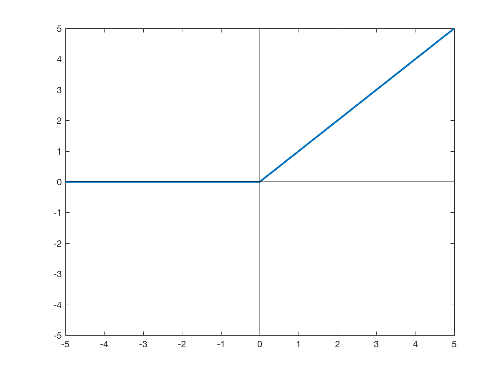
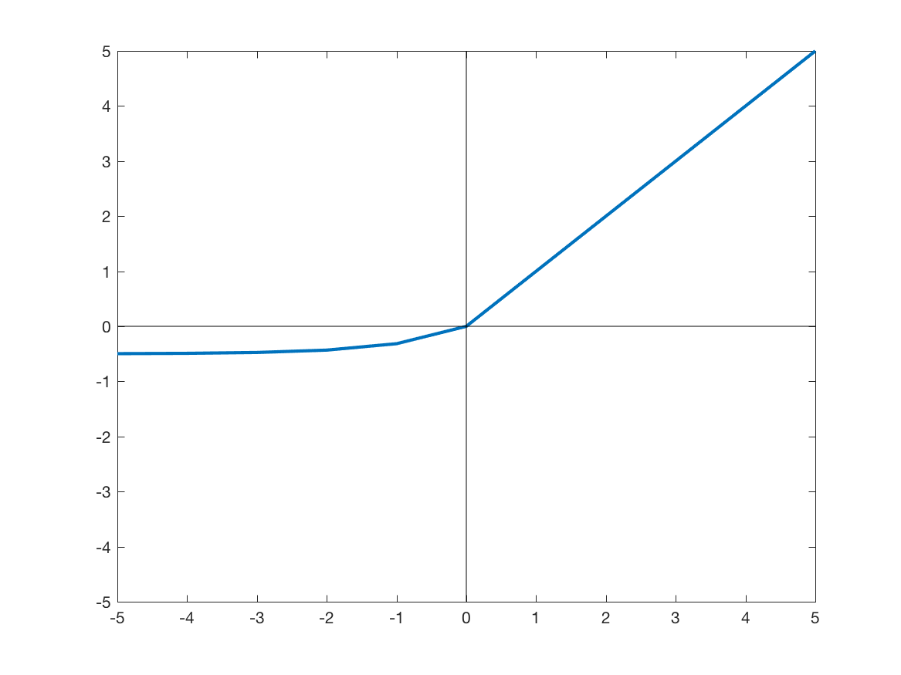
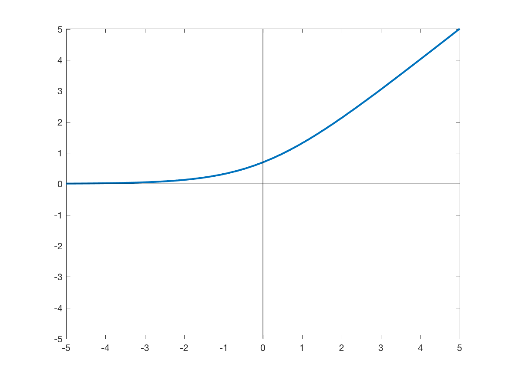
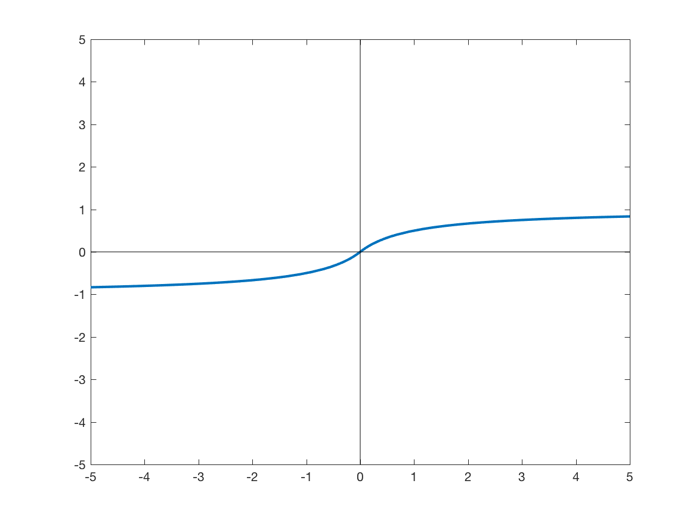
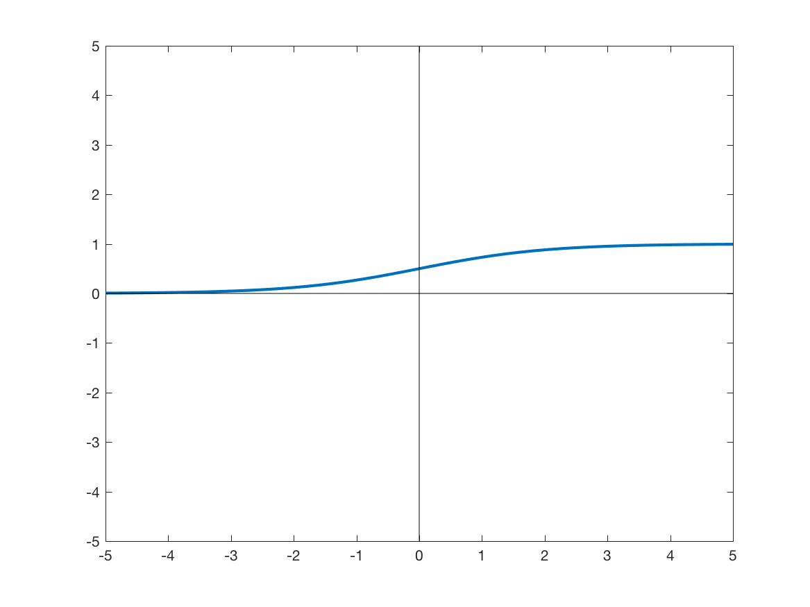
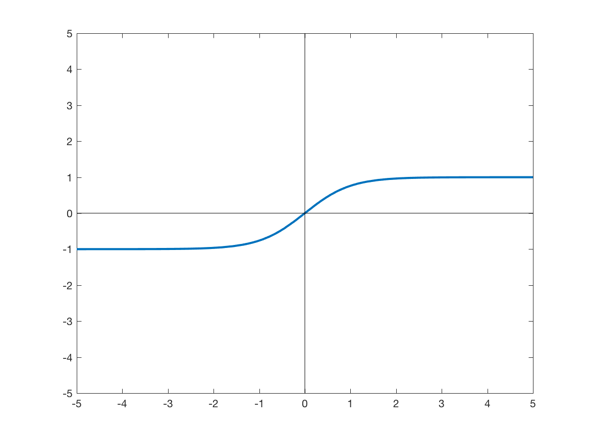
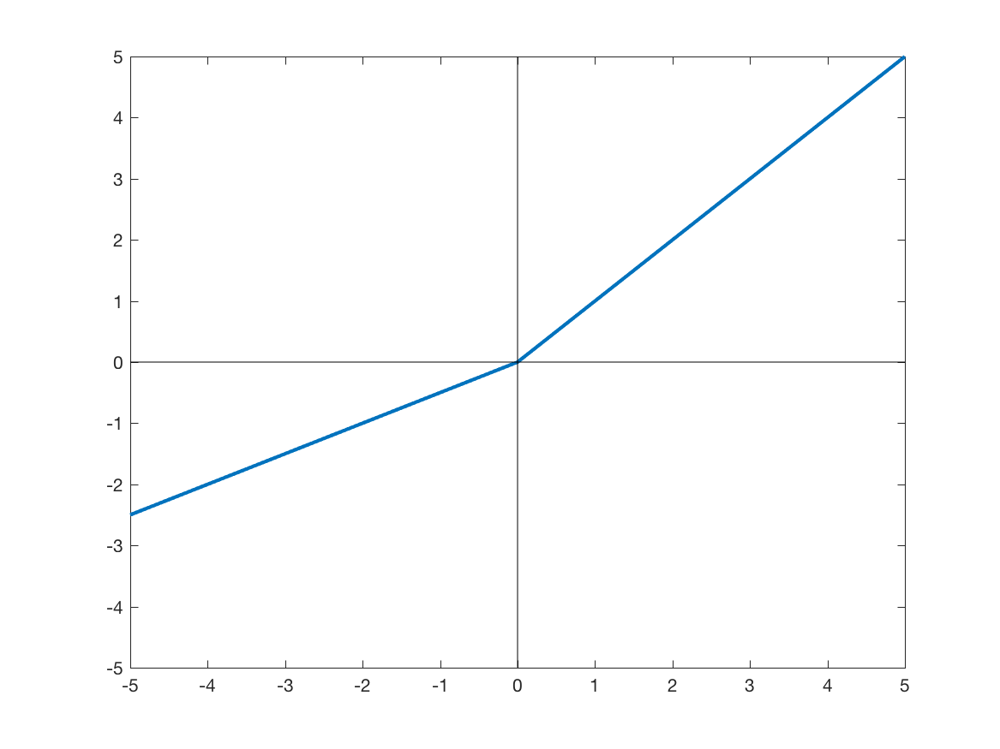

# Layers

Summary of layers that can be used to build networks and their characteristics

## Activation
File: activation.py
Possible activation layers to be specified as the acti_func field of ConvolutionLayer or DeconvolutionLayer among the following values:

Field | Equation | Graph
------|----------|------
relu  |[relu_eq](./figures/relu_eq.pdf)| 
relu6 |[relu6_eq](./figures/relu6_eq.pdf)| tes
elu | |
softplus |[softplus_eq](./figures/softplus_eq.pdf)|
softsign |[softsign_eq](./figures/softsign_eq.pdf) |
sigmoid |[sigmoid_eq](./figures/sigmoid_eq.pdf)|
tanh |[tanh_eq](./figures/tanh_eq.pdf) |
prelu |[prelu_eq](./figures/prelu_eq.pdf) |
dropout | |

## Batch normalisation
File: bn.py
Class: BNLayer
Fields:

* regularizer: None
* moving_decay: 0.9
* eps
* name
Layer that applies normalisation to the input batch.

## Convolution
File: convolution.py
Classes: ConvLayer and ConvolutionLayer

The convolution layer (called as ConvLayer) takes as fields:

* n_output _chns : Number of output channels/features
* kernel_size : window size of the convolution
* stride : Stride with which the kernel is applied
* padding : ['SAME'/'VALID'] Padding strategy applied
* with_bias: [True/False] Application of a bias
* w_initializer: Initialisation for the weights
* w_regularizer: Regularisation strategy for the weights
* b_initializer: Initialisation strategy for the bias
* b_regularizer: Regularisation strategy for the bias

ConvolutionLayer combines the following optional layers: ConvLayer, batch normalisation, activation,
Takes as fields those necessary for a ConvLayer, a BatchNormLayer, an activation layer. Dropout is applied according to the argument keep_prob applied when calling the layer.

## Conditional Random Field

## Cropping
File: crop.py
Class: CropLayer
Operates the cropping of the data it is applied to resulting in the centered part of the data given the field ***border*** cropped in each spatial dimension on both sides.

## Deconvolution
File: deconvolution.py
Class: DeconvLayer and DeconvolutionLayer

Fields are similar to those needed for ConvLayer

DeconvolutionLayer composes in order the following (optional) layers: deconvolution, batch normalisation, activation and dropout. See the fields and arguments of the convolution file for details.

## Dilated context
## Downsampling
File: downsample.py
Class: DownSampleLayer
Fields:

* func: ['AVG'/'MAX'/'CONSTANT'].
* kernel_size: Determines the size of the kernel that will be applied
* stride: Striding parameter of the kernel
* padding: ['SAME'/'VALID']
* name

## Elementwise operations
File: elementwise.py
Class: ElementwiseLayer
Fields:

* func: ['SUM','CONCAT']
* initializer
* regularizer
* name

Performs elementwise operations between two outputs coming from two different network flows given as arguments.

*Case of SUM operation*: 0 padding is applied on the features dimension for the second argument if the first argument has more features. Projection is made in the opposite case.

## Input normalisation

File: input_normalisation.py
Class: HistogramNormalisationLayer
Fields:

* models_ filename: Text file with the intensity landmarks trained for each modality. It corresponds to the histogram_ref _file field given on the command line/ config file. If not provided, the folders
* multimod_mask _type ['and'/'or'/'all']: Strategy applied when creating a mask used for landmark extraction from multiple modalities either as intersection (and), union (or) or considering each modality separately (all)
* norm_type: ['percentile'/'quartile'] strategy of landmarks used for the piecewise linear adaptation
* cutoff: Landmarks cutoff points to be used for the histogram matching. 2 values (min and max) should be given in the range ]0 - 1[ Default value is (0.05,0.95)
* mask_type: ['otsu_plus'/ 'otsu_minus'/ 'thresh_plus'/ 'thresh_minus']. Strategy applied to obtain the image mask
* name

Layer takes as arguments the input 5d image on which to apply the normalisation and flags indicating if any normalisation and/or whitening should be applied.
The normalisation follows [the method](http://ieeexplore.ieee.org/abstract/document/836373/) developed by Nyul et al [^1]
[^1]: Nyúl, L. G., Udupa, J. K., & Zhang, X. (2000). New variants of a method of MRI scale standardization. IEEE transactions on medical imaging, 19(2), 143-150.

## Loss functions
Loss functions are application-specific. 

File: loss_segmentation.py
Class: LossFunction
Fields:

* n_class: Number of classes/labels
* loss_type: ['CrossEntropy'/ 'Dice'/ 'Dice_NS'/ 'GDSC'/ 'WGDL'/ 'SensSpec'/ 'L1Loss'/ 'L2Loss'/ 'Huber'] Name of the loss to be applied
* loss_func_params: Additional parameters to be used for the specified loss
* name

Following is a brief description of the loss functions for segmentation: 

Loss function| Notes | Citation | Additional Arguments
------|----------|------ | -----| 
Cross-entropy |  | 
Dice Loss |  | "V-net: Fully convolutional neural networks for volumetric medical image segmentation", Milletari, et al, 3DV 2016.
Dice Loss (no square) | Similar to Dice Loss, but probabilities are not squared in the denominator. |
Generalised Dice Loss | | "Generalised Dice overlap as a deep learning loss function for highly unbalanced segmentations", Sudre, C. et. al.  DLMIA 2017.
Generalised Wasserstein Dice Loss | | "Generalised Wasserstein Dice Score for Imbalanced Multi-class Segmentation using Holistic Convolutional Networks", Fidon, L. et. al. MICCAI 2017 (BrainLes).
Sensitivity-Specificity Loss  | | "Deep Convolutional Encoder Networks for Multiple Sclerosis Lesion Segmentation", Brosch et al, MICCAI 2015. | r: default 0.05. The 'sensitivity ratio' (authors suggest values from 0.01-0.10 will have similar effects)

File: loss_regression.py 
Class: LossFunction
* n_class: Number of classes/labels
* loss_type: ['L1Loss'/ 'L2Loss'/ 'Huber'/ 'RMSE'] Name of the loss to be applied
* loss_func_params: Additional parameters to be used for the specified loss
* name

Following is a brief description of the regression loss functions: 

Loss function| Notes | Citation | Additional Arguments
----------|----|---- | ---| 
L1 Loss | |
L2 Loss | | 
Huber Loss |     The Huber loss is a smooth piecewise loss function that is quadratic for &#x7c;x&#x7c; <= delta, and linear for &#x7c;x&#x7c;> delta. See https://en.wikipedia.org/wiki/Huber_loss| | delta: default 1.0
Root Mean Square Error | | | 

## Random flip
This layer introduces flipping along user-specified axes. 
This can be useful as a data-augmentation step in training. 

File: rand_flip.py 
Class: RandomFlipLayer
Fields: 

* flip_axes: which axes to flip on. 
* flip_probability: default 0.5. The probability of flipping along any of the specified axes. 

## Random rotation
File: rand_rotation.py
Class: RandomRotationLayer
Fields:

* min_angle: Minimum angle considered in the random range
* max_angle: Maximum angle considered in the random range

The random rotation belongs to the set of possible augmentation operations.
*Note* The random rotation is only applied on 3d data.

## Random spatial scaling
File: rand_spatial_scaling.py
Class: RandomSpatialScalingLayer.py
Fields:

* min_percentage: Value between 0 and 100 that indicates the range of possible random scaling to be applied.
* max_percentage: Value between 0 and 100 that indicates the range of possible random scaling to be applied.
* name

The random spatial scaling is one of the possible augmentation operations.
The scaling factor is computed as [(min_percentage+100)/100, (max_percentage+100)/100]

## Upsampling
File: upsample.py
Class: UpSampleLayer
Fields:

* func: ['REPLICATE'/'CHANNELWISE_DECONV']
* kernel_size
* stride
* w_initializer
* w_regularizer
* with_bias
* b_initializer
* b_regularizer

This upsampling layer can allow for two strategies of upsampling.
*Note* if func is REPLICATE, kernel and strides must be of the same size. The data is locally replicated. If func is CHANNELWISE_DECONV, the channels are upsampled separately using a DeconvLayer.
